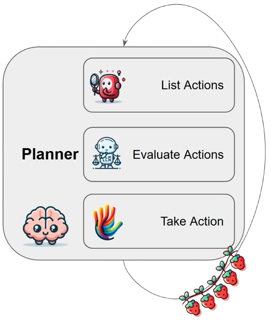

# P1: Imitating OpenAI's O1 Capabilities in Less Than 30 Lines of Code

**Author:** Beibin Li

## Introduction

This repository tries to imitate OpenAI's O1 feature using a custom P1Agent built with AutoGen, all in under 30 lines of code (excluding auxiliary code for prompt, logging, wrapping, cost calculation, etc.). This is a personal project developed independently, and please do not include your personal or organizational API keys in discussions or pull requests.

The P1Agent can leverage GPT-4, Llama, or any compatible language model as its backbone. In the provided [example notebook](example.ipynb), we showcase how the P1Agent, even when using a smaller model (i.e., GPT-4o-mini), can perform reasoning and planning well on a simple stock analysis question.

## What is OpenAI's O1 Feature?

OpenAI's O1 is an advanced language model that introduces enhanced planning and reasoning capabilities, enabling it to handle complex, multi-step problems more effectively than previous models. While the specific architectures and training methods behind O1 are proprietary, this project aims to replicate some of its functionalities using publicly available tools and models.

## Key Features

- **Planning-Based Problem Solving**: Implements a planning-based approach to enhance reasoning capabilities.
- **Two-Agent System**: The P1Agent interacts internally with a planner agent to devise solutions.
- **Handles Complex, Multi-Step Problems**: Capable of solving intricate problems that require multiple reasoning steps.
- **Performance Improvement**: Outperforms baseline models on specific tasks, demonstrating enhanced effectiveness.

## How It Works

```python
from planner import p1_reply

config_list = [
    {
        "model": "gpt-4o-mini",  # Replace with your desired model
        "api_key": os.environ["OPENAI_API_KEY"],  # Ensure you have your own API key set in the environment
    }
]

response = p1_reply("Is 9.11 or 9.7 larger?", config_list, verbose=True)
print(response)
```



1. **User Query**: The P1Agent receives a question from the user.
2. **Plan Generation**: It generates a plan trajectory using a separate planner agent.
3. **Action Proposal and Evaluation**: The planner proposes and evaluates multiple actions at each step.
4. **Action Selection**: The best action is selected and added to the trajectory.
5. **Iteration**: Steps 3 and 4 repeat until the planner decides to terminate.
6. **Response Generation**: The final trajectory is used to generate the agent's response to the user.

## Limitations

1. **Simplified Model Replication**: OpenAI's O1 is a model trained with advanced datasets and techniques. Our approach attempts to reproduce its functionality without fine-tuning or additional training of the language model, which may lead to reduced accuracy or performance.
2. **Limited Testing**: Testing has been limited to a few testing examples compared against O1. Comprehensive experiments and evaluations are needed to thoroughly assess the agent's capabilities.
3. **Dependency on Backbone Models**: The performance of the P1Agent heavily relies on the chosen backbone model. Using less powerful models may result in suboptimal performance.
4. **Future Improvements**: There is potential for optimization in prompts, code efficiency, and agent architecture. Incorporating feedback mechanisms and more sophisticated prompt engineering could enhance performance.

## Accuracy Comparison on the MATH Dataset

We evaluated the performance of the P1Agent using a random subset of the [MATH dataset](https://github.com/hendrycks/math/), which contains challenging mathematical problems designed to test advanced reasoning abilities of language models.

The P1Agent significantly enhances performance over the baseline model. The P1Agent using GPT-4o-mini can achieve similar performance as GPT-4o, although it still falls short of the performance of OpenAI's O1 model.

**Note:** This analysis was conducted using only one dataset. Further evaluation is required to confirm the P1Agent's performance across diverse datasets and model architectures.

## The Story

Since the release of OpenAI's O1 model, I have been interested in replicating its features using simple tools. This project was developed during spare time to explore how AutoGen could be used to mimic O1's planning capabilities without the need for extensive model training or fine-tuning. Because of it is a personal projects, I do not have enough API quota to test it with more models and datasets. Feel free to take the current implementation and improve it.

This repository is licensed under the MIT License, allowing for open access and contributions.

## Acknowledgments

1. **OpenAI O1**: [Introducing OpenAI O1 Preview](https://openai.com/index/introducing-openai-o1-preview/)
2. **G1 Project**: Inspiration drawn from [G1](https://github.com/bklieger-groq/g1), which attempts to reproduce O1 using Llama models.
3. **AutoGen**: This code is built on the foundations of [AutoGen](https://github.com/microsoft/autogen).
4. **OptiGuide and Reflect-RL**: Agent design inspired by the [OptiGuide paper](https://arxiv.org/abs/2307.03875) and the [Reflect-RL paper](https://arxiv.org/abs/2402.12621).
5. **Prompts and Techniques**: Influenced by chain-of-thought (CoT), tree-of-thought (ToT), reason-and-then-act (ReAct) prompting methods, as well as traditional reinforcement learning algorithms like Actor-Critic and policy gradients.
